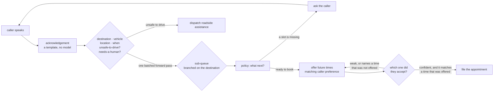
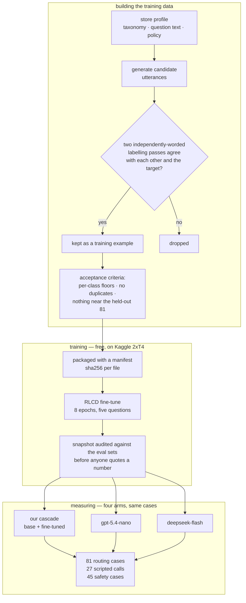

# jev-classifier — demo pack

A local call-router for a car-dealership switchboard. It runs on a laptop, decides in ~20 ms, costs
nothing per call, and every decision it makes is inspectable.

The model is [Laya](https://github.com/NandhaKishorM/laya) — a small **non-autoregressive** model that
returns *typed decisions* instead of generating text. `tokens generated` stays at `0` on every call.
That is the point of the technology and the reason the economics work.


---

## How a call flows



Two things to notice, because they are the design:

- **The classifier does *understanding*** (department, intent, slot values, urgency, escalation).
  **A deterministic policy does *control flow*** (which slot to ask for, when the booking is done,
  which queue it lands in). Measured: a `next_action` question answered at confidence 0.03 and picked
  `ask_detail` regardless of input. Control flow is not a good classifier question.
- **The un-gettable-by-classifier facts are rules**: the exact appointment time, the caller's name,
  the callback number, and whether the reply names a time that was offered. A model should not be
  asked to parse what a regex cannot get wrong.

---

## What you see in the debugger

Rows are turns. Columns are decisions, left to right. Nothing moves while a call streams in, so it
screen-records cleanly.

```
┌ controls ────────────────────────────────────────────────────────────────────────────┐
│ scenario ▾   ▶ Run call   ⏸ Play  ⏭ Step  ⏩ Skip  ↺ Reset   speed ─●──  ⤢ Fit  ☑ follow │
├──────────────┬──────────────────────────────────────────────────────┬───────────────┤
│ CONVERSATION │              D E C I S I O N   G R A P H             │   INSPECTOR   │
│  (collapsible)                                                       │  (drill-down) │
│  turn 1      │  turn 1  ☎ ─▶ [Department] ─▶ [Vehicle] ─▶ … ─▶ 🎧    │  question     │
│  ☎ caller    │  turn 2  ☎ ─▶ [Department] ─▶ [Vehicle] ─▶ … ─▶ 🎧    │  every option │
│  🎧 agent    │  turn 3  ☎ ─▶ …                                       │  + probability│
│              │  turn 4  ☎ ─▶ … ─▶ [Next step] ─▶ 🎧 ─▶ ◆ ROUTE       │  confidence   │
└──────────────┴──────────────────────────────────────────────────────┴───────────────┘
```

- **Colour says who decided**: caller (blue) · model (violet) · rule or regex (slate) · switchboard
  (green) · route out (amber). A node's badge is its primitive — `choice`, `noul`, `policy`, `regex`.
  **The UI never pretends a model decided something a rule decided.**
- **Click any box** for the question, every option with its probability, entropy confidence *and* top
  probability, which checkpoint answered, why it was routed there, latency, and raw JSON.
- **`follow` keeps the camera on the active decision**; turn it off to frame the whole call.
- **Playback is client-side**, so play / pause / step / scrub never touch the backend. Every run is
  replayable from the recording.

---

## How it was built and measured



Every gate in that pipeline is a command that **exits non-zero when it fails**, rather than a
judgement call. The teacher is `deepseek-flash`, and a candidate only becomes training data when two
independently-worded passes agree — a high-precision filter that yielded zero invalid labels in
1,394 rows. The teacher's own agreement with our hand labels was 0.975 destination / 0.901
sub-queue. That is a reference point, not a mathematical ceiling on a student model.

---

Measured on 81 hand-labelled routing cases and 27 scripted calls, against two frontier arms.

| | base model | **the fine-tune we demo** | gpt-5.4-nano | deepseek-flash |
| --- | --- | --- | --- | --- |
| destination | 0.654 | 0.914 | 0.963 | **0.975** |
| joint (dest + sub-queue) | 0.518 | 0.876 | 0.889 | **0.901** |
| **call outcome** (27 calls) | 0.778 | **0.926** | 0.963 | 0.963 |
| routing latency, per case | 20 ms | **21 ms** | 651 ms | 1,451 ms |
| cost per call (4 turns) | **$0** | **$0** | $0.000119 | $0.000476 |
| determinism (3 repeats) | **1.00** | **1.00** | 0.98 | 0.99 |

On this v7 run the fine-tune is **two cases behind DeepSeek on joint routing** (71/81 versus 73/81).
That difference is too small for this set to establish a quality ranking. Earlier DeepSeek runs
scored 0.889–0.926 on the same inputs. The local model is roughly 70× faster per routing case and
has no API cost; the current sample supports "close," not a proven tie or win.

Three relevant checkpoints illustrate the tradeoffs:

| | routing joint | call outcome | booking | provenance |
| --- | --- | --- | --- | --- |
| v6 (five questions trained) | **0.926** | 0.852 | not measured | 7 contaminated rows |
| **v7 — what `models/active` points at** | 0.876 | **0.926** | **1.000** | clean |
| v8 (the later clean experiment) | 0.889 | 0.889 | 1.000 | clean |

v7 is loaded because **the call outcome is the product metric**, and v7 is the only one that gets the
body-shop bookings right — v6 sends *"rear-ended me, I need body work"* and *"a stone cracked my
windscreen"* both to Roadside / Towing, which a viewer would spot immediately.

---

## The safety questions

`is_safe_to_drive` dispatches roadside assistance. `needs_human` decides whether a person takes the
call. Neither had ever been measured before this session.

The active v7 report (`results/severity_v7.json`) has 45 labelled cases, including 18 hazards.
Both rows below are measured at the configured policy threshold: 0.7 for safety.

| | recall | false alarms (27 safe) | precision on the set | @5% base rate | @2% base rate |
| --- | --- | --- | --- | --- | --- |
| base | 0.444 | 0 | 1.000 | 1.000* | 1.000* |
| **active v7 fine-tune** | **1.000** | 3 | 0.857 | 0.321 | 0.155 |

*The base row's projected precision of 1.000 follows from zero false alarms in 27 negatives;
that tiny sample does not establish perfect specificity in deployment.*

The fine-tune catches all 18 hazards in this set but sends three safe calls to roadside. The
long-data v6 experiment had eight false alarms; the register-corrected v7 cut that to three. The
base model had fewer false alarms but missed ten hazards at the same policy threshold. These are
different checkpoints and should be described as a tradeoff, not a solved safety classifier.

The `needs_human` gate is also weak: v7 finds 5/7 cases that need a person and falsely flags 20/38
routine cases. The fine-tuned destination classifier is confident on all seven of its errors, so
the current confidence threshold cannot reliably catch bad routes for escalation.

**But read the last column, because it flatters us.** The set is **40% positive** — deliberately,
because unsafe calls are rare and you need them concentrated to measure recall at all. Precision
depends on the base rate, and 40% is eight to twenty times what a switchboard sees. At an assumed 2%
hazard rate, projected precision is 0.155 — so most dispatch flags would still be wrong.
The base rate itself is assumed, not measured, and the code sets a *flag and a queue* rather than
sending a truck. `eval_severity.py` prints this table for every arm and a test pins the round trip.

---

## What we found

The model barely changed this session. **What changed is that the measurements behind it are true.**

**Seven silent failures now have tests.** The recurring shape is one fact in two places — or two facts
in one place — resolved quietly and wrongly. None of them threw an error:

1. The taxonomy contradicted itself (a sub-queue advertised tire rotations while the rotation case was
   labelled elsewhere) — 5 points of ceiling lost to a definitional clash.
2. A renamed field left a stale reference that silently swallowed a third of the generation work.
3. Training and inference asked the sub-queue question with different capitalisation — the fine-tune
   would have been asked a question it had never seen.
4. One safety threshold existed in three places, so a caller could be dispatched as unsafe while the
   audit trail said they were not.
5. The Kaggle notebook is *generated*; the generated copy had drifted and copied four of six data
   files, so a whole GPU run trained 2,512 items instead of 6,210 with no error.
6. The epoch count lived in a shell variable, and regenerating the notebook silently reset the run
   from eight epochs to four.
7. `build_items.py` printed a note and carried on when a data file was missing — which is what made
   #5 invisible.

**Three measurements were reading their own training data.** The acceptance classifier reported
**1.000 accuracy** — it was scoring the file training is built from. Two more leaked by *containment*:
a short eval utterance sitting inside a longer training row, which no exact-text check can see.

**And every fine-tune from v3 onward was scored partly on data it trained on.** `gen-01` sat verbatim
inside a training row in four checkpoints, and all four answered it correctly. My guard checked
`data/calls/`; the checkpoints trained on the frozen snapshot beside their weights. **A second reader
found that by hand, after the numbers had been published.** `kaggle_run.py watch` now audits the
snapshot at download and records a sha256 per file, so a checkpoint carries its own provenance.

**The training data was in the wrong register.** 27-word chatbot prose against 11-word eval cases and
5-word caller turns. The negative class contained no *short, bare statement of a fault that isn't a
hazard*, so the only rule available to the model was **"short + something's wrong ⇒ unsafe"** — which
is exactly the false-positive pattern:

```
"The air conditioning isn't blowing cold air any more."    called unsafe, p=0.999
"The driver's seat won't slide forward any more."          called unsafe, p=1.000
```

Generating terse examples in **both** classes cut dispatch false alarms from **10 to 3** with recall
held at 1.000 — confirmed by a clean additive run. The same addition cost 3.7 points of routing and
`needs_human` recall, because all five questions share one encoder, so data added for one question is
not local to it.

**And the app was serving the base model.** `get_router()` never named a checkpoint, so every call was
the stock 0.654 model while the docs said 0.963. Calls ran, the graph drew, the probabilities were
plausible. They were the wrong model's.

---

## What isn't done

- **The dispatch still fires too often for a real switchboard.** The active v7 report records three
  false alarms among 27 safe calls. At an assumed 2% hazard rate, projected precision is low and
  most flags would be wrong. The
  queue override itself is *correct*: it is how someone stuck on the highway reaches a tow instead of
  a booking. So the fix is more precision, not structure.
- **`needs_human` recall** fell to 0.714 when the terse hazard rows were added: they are all escalation
  positives and they dilute a class otherwise made of complaints and billing disputes.
- **A second human labeller.** `det-04` is missed by every model including both frontier arms; `gen-08`
  is answered against our label by all three. Where every model disagrees with the key, the key is the
  likeliest thing to be wrong. This is the ceiling on the destination number.
- **The store facts are loaded but unused** — the switchboard transfers "what time do you open?"
  instead of answering it.
- **The `other` fallback is dead.** The fine-tuned model never abstains, so there is no "I'm not sure"
  left anywhere in the system.

---

## Running the demo

```bash
uv sync
uv run uvicorn jev_classifier.api:app --port 8765      # backend
cd web && npm install && npm run dev                   # frontend on :5173
```

Open <http://localhost:5173>.

**Check the startup line before you present:**

```
laya: serving fine-tuned checkpoint models/active        <- correct
laya: serving the BASE checkpoint. Routing quality ...   <- STOP, wrong model
```

`models/active` is a symlink to the checkpoint to serve. To switch it:

```bash
ln -sfn "$(pwd)/models/kaggle-out-v7/laya-dealership-routing" models/active
```

---

## The demo script

The UI dropdown has **twelve** scenarios. Run `uv run python scripts/check_demo.py` before presenting;
it checks the actual checkpoint, queue and completion state using a temporary booking store. Eleven
scenarios pass; the twelfth is a visible model failure.

| scenario | blurb | routes to | |
| --- | --- | --- | --- |
| `collision`, `buy_car`, `vague`, `tire_quote` | Body Shop, Sales, Service, Tires | the right queue | ✓ book |
| `no_start`, `flat_tire` | stranded callers | **Roadside / Towing**, HIGH | ✓ dispatch |
| `part_order`, `finance_question`, `hours` | questions for a team | Parts, Finance, Front Desk | ✓ handoff |
| `out_of_scope`, `job_applicant` | non-customer calls | Front Desk | ✓ handoff |
| `ambiguous_off_topic` | neighbour's dog | *Roadside / Towing* | ✗ known model failure |

**1. Route and book — `collision`.** *"Someone rear-ended me in a parking lot yesterday. I need body
work."* → **Body Shop**, then a confirmed appointment. Click the destination node: the options,
their probabilities, the `choice` badge. Five turns.

**2. Show the same decision working the other way — `no_start`.** *"my car won't start at all"* →
**Roadside / Towing**, priority HIGH, dispatched. Same question, opposite answer, and the two calls
side by side are the point: one decision sending bookers to a department and stranded callers to a
tow.

**3. Book an appointment — `buy_car`.** Watch it refuse three times, then book:

```
turn 3  "I haven't chosen a time yet" -> asks again   (no time accepted)
turn 4  "this is Dana, 555-0140"     -> asks again   (no time mentioned at all)
turn 5  "Sunday at 3am works"        -> asks again   (the store is closed)
turn 6  "the first one please"       -> books
```

Turns 4 and 5 are the two failure modes this used to have — inventing an agreement from no time, and
from a closed day. **This is the best moment in the demo**: a system declining three times to act on
something it cannot verify, then filing a real appointment with a name on it.

**4. Show the evidence.** The `Evidence` tab reads the measurements live from `results/*.json`.

### If something goes wrong

- **Calls route badly** → the app is on the base checkpoint. Check the startup line.
- **`ambiguous_off_topic` goes to Roadside / Towing** → known safety false positive. Its second
  clarifying turn is never heard because the first turn triggers an immediate dispatch. The UI
  labels the mismatch and `check_demo.py --strict` fails on it.
- **"Awaiting caller" appears** → the scripted turns ended after a question or time offer. The
  queue below it is only provisional; no transfer or appointment was completed.
- **The booking asks again instead of booking** → the offered-time veto doing its job. If the caller
  names a day that was not offered it will always ask again; that is the fix, not a fault.

---

## What not to claim

- **Not "we beat deepseek."** v7 is 71/81 joint versus DeepSeek's 73/81 on this run. The sample
  cannot resolve that gap. Say: close on this set, about 70× faster per routing case, with no API fee.
- **Not "the safety classifier is fixed."** It caught every stranded caller in the held-out safety
  set, with three false alarms among 27 safe calls. The off-topic demo failure is an additional
  reason to keep it away from unattended dispatch.
- **Not "1.000 booking accuracy"** without saying it is measured on held-out *reply phrasings*, not
  held-out conversations.
- **Not "the threshold is tuned."** The sweep is flat from 0.3 to 0.8 — the probabilities are
  saturated, so the threshold is not a control we actually have.
