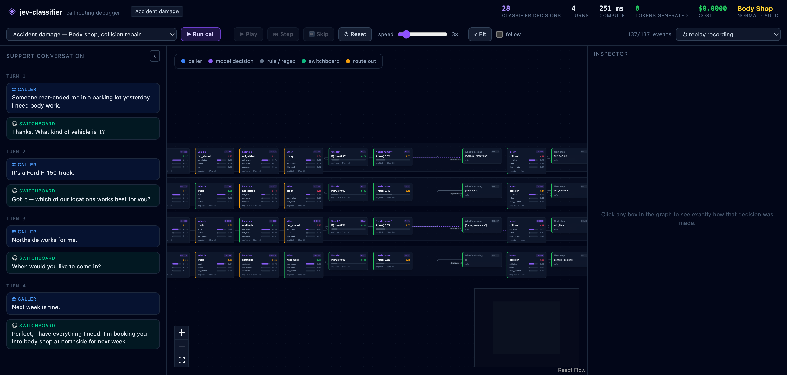

# jev-classifier

A local **call-routing debugger** for a car-dealership switchboard, built on
[Laya](https://github.com/NandhaKishorM/laya) — a non-autoregressive _System 1_ decision model
that returns **typed, calibrated decisions** instead of generated text — running on Apple Silicon
via [`laya-mlx`](https://pypi.org/project/laya-mlx/).

A scripted caller talks to a classifier-driven switchboard. Every decision the switchboard makes
is a Laya question, the graph shows the call flowing left to right, and clicking any box reveals
exactly how that decision was made.

**The model never generates text.** `tokens generated` stays at `0` in the HUD on every call —
that is the point of the technology, and the reason the economics work.



## Run it

Backend (Apple Silicon, Python 3.12 — `uv` fetches it):

```bash
uv sync
uv run uvicorn jev_classifier.api:app --port 8765
```

Frontend, one of:

```bash
cd web && npm install && npm run dev      # dev server on :5173, proxies /api to :8765
cd web && npm install && npm run build    # or build; FastAPI then serves it at :8765
```

Open <http://127.0.0.1:8765> (build) or <http://localhost:5173> (dev).

## The visual debugger

```
┌ controls ────────────────────────────────────────────────────────────────────────────┐
│ scenario ▾   ▶ Run call   ⏸ Play  ⏭ Step  ⏩ Skip  ↺ Reset   speed ─●──  ⤢ Fit  ☑ follow │
├──────────────┬──────────────────────────────────────────────────────┬───────────────┤
│ CONVERSATION │              D E C I S I O N   G R A P H             │   INSPECTOR   │
│  (collapsible)                                                       │  (drill-down) │
│  turn 1      │  turn 1  ☎ ─▶ [Department] ─▶ [Vehicle] ─▶ … ─▶ 🎧    │  question     │
│  ☎ caller    │  turn 2  ☎ ─▶ [Department] ─▶ [Vehicle] ─▶ … ─▶ 🎧    │  every option │
│  🎧 agent    │  turn 3  ☎ ─▶ …                                       │  + probability│
│              │  turn 4  ☎ ─▶ … ─▶ [Next step] ─▶ 🎧 ─▶ ◆ ROUTE       │  confidence   │
└──────────────┴──────────────────────────────────────────────────────┴───────────────┘
```

- **Rows are turns, columns are decisions.** Positions are computed from `(col, turn)` and never
  recomputed, so nothing jumps around while the call streams in — which matters when you are
  screen-recording.
- **Colour says who or what**: caller (blue) · model decision (violet) · rule / regex (slate) ·
  switchboard (green) · route out (amber). A node's badge is its primitive (`choice` / `noul`)
  or, for the deterministic nodes, `policy` / `regex` — the UI never pretends a model decided
  something a rule decided.
- **Click any box** for the question, every option with its probability, the entropy confidence
  _and_ the top probability, which checkpoint answered and why it was routed there, latency,
  how many questions shared the forward pass, and raw JSON.
- **`follow` keeps the camera on the active decision** so you can watch the call move through the
  pipeline; turn it off (or press `F`) to frame the whole call.
- **Playback is client-side** — play / pause / step / speed / scrub all work without touching the
  backend, because a call is executed eagerly, recorded, and returned as an event list. That also
  means **every run is replayable**: `replay recording…` re-plays a past call deterministically
  for a clean recording. Space toggles play, `→` steps.

## The call

Eight departments: `service · body_shop · parts · tires · detailing · sales · finance · towing`
(plus `general`). Each turn the switchboard re-reads the whole conversation and runs two batched
forward passes:

1. **department + slots** — vehicle, location, when, unsafe-to-drive, needs-a-human
2. **intent** (branched on the department) — then policy picks the next step

Slots are `choice` questions over fixed enums, not free-text extraction, because Laya classifies
rather than parses. The one exception is the exact appointment time, which is a deterministic
regex rendered as a different node kind.

**Where the classifier decides vs. where policy decides.** The classifier does _understanding_:
department, intent, slot values, urgency, escalation. A deterministic policy does _control flow_:
which slot to ask for next, when the booking is complete, which queue it lands in. That split is
not an accident — see the measurements below.

## What measuring the model changed

Laya's base checkpoints are weak zero-shot and very sensitive to wording, so every question here
was chosen from a measurement, not intuition. `scripts/probe_slots.py` and `scripts/probe_questions.py`
are the evidence. Three findings shaped the design:

1. **"Explicitly mention… otherwise `not_stated`"** — the first slot questions _invented_ facts:
   asked "What kind of vehicle?" about a sentence that never mentioned a vehicle, the model
   answered `sedan`. Rewording to "What kind of vehicle did the caller explicitly mention? If no
   vehicle type was mentioned, choose `not_stated`" took slot accuracy from **19/24 to 23/24**.
2. **Do not let the agent read out the option list.** When the switchboard asked "today, tomorrow,
   later this week, or next week?", the slot classifier started answering `today` even when the
   caller had said nothing about timing — the agent's own question was leaking into the transcript
   the model classifies. The spoken prompts no longer enumerate; the options are still shown as
   chips in the UI.
3. **Control flow is not a good classifier question.** A `next_action` question ("what should the
   switchboard do next?") answered at **confidence 0.03** and picked `ask_detail` almost
   regardless of input, while an earlier unconstrained version happily chose `confirm_booking`
   with the location still unknown. It was removed and replaced with policy. The classifier stayed
   where it is strong.

A fourth finding, from the earlier support-triage build, still applies: a **hard stop must not
fire on an argmax of a near-uniform distribution** — reject only on a confident signal.

## Why it doesn't re-decide what it already knows

The first implementation ran all seven questions on **every** turn, re-reading the whole growing
transcript each time. Turn 4 of a four-turn call re-asked what turn 1 had already established:

| collision scenario    | turn 1 | turn 2 | turn 3 | turn 4 | total             |
| --------------------- | ------ | ------ | ------ | ------ | ----------------- |
| questions — before    | 7      | 7      | 7      | 7      | **28**            |
| questions — now       | 7      | 4      | 3      | 2      | **16** (−43%)     |
| input tokens — before | 720    | 895    | 1070   | 1259   | 3944              |
| input tokens — now    | 720    | 479    | 406    | 318    | **1923** (−51%)   |
| compute — before      | 60 ms  | 64 ms  | 71 ms  | 78 ms  | **272 ms**        |
| compute — now         | 59 ms  | 30 ms  | 22 ms  | 23 ms  | **134 ms (−51%)** |

Three mechanisms:

- **Settled facts are skipped.** Each turn keeps a session of what is already known. A fact is
  _pinned_ when it is a concrete value answered decisively enough to rely on; pinned facts are not
  re-evaluated, and appear in the graph as dimmed _"already known — settled turn N"_ nodes.
- **`not_stated` is never pinned.** Resolving "the caller hasn't said" is the whole point of a
  later turn, so those stay open. This is what keeps self-correction working: in the collision
  call the `when` answer is wrong for two turns (`today`, inferred from "yesterday") and then
  settles correctly to `next_week` on turn 4 — because it was never pinned.
- **One change-detector buys the right to skip several.** From turn 2 on, a single `noul`
  question — _"does the caller's latest message change or add to anything said earlier?"_ — runs
  alongside the unresolved questions. If it fires, the pinned facts are re-evaluated in a second
  pass; if not, they are skipped.

**Pinning uses top probability, not entropy confidence.** They are different questions and want
different numbers: `confidence` (entropy, 0.75) asks _"should a human look at this?"_, while
pinning (top probability, 0.6) asks _"can we stop re-deciding this?"_. Judging pinning by entropy
confidence never settled `intent`, because a 7-option question with a clear winner (p = 0.72)
scores only 0.42.

`scripts/bench_call.py` reproduces the table; `--out results/*.json` keeps a baseline to diff against.

## Second opinions, not second guesses

When a classification question is not decisive (top probability below 0.75 for `department` or
`intent`), the switchboard asks it **again in different words** — the paraphrase lives in
`dealership.department_question_paraphrase` — and compares the two answers.

- **Agreement** settles the question: two independently-worded phrasings landing on the same
  answer is evidence, and the fact is pinned (so later turns skip it).
- **Disagreement** does _not_ overturn the first answer. It keeps it and flags the call for an
  LLM or a human.

In the vague-complaint scenario: **2 second opinions, 0 LLM calls**, and the call routes cleanly
to the Service Department.

Verification costs one extra question and largely pays for itself, because agreeing phrasings let
`department` and `intent` settle a turn earlier:

| collision        | questions | tokens | compute    |
| ---------------- | --------- | ------ | ---------- |
| before           | 28        | 3944   | 272 ms     |
| incremental only | 16        | 1923   | 134 ms     |
| + verification   | 17        | 2020   | **130 ms** |

**The rejected design, and why.** The obvious tier-2 is to _narrow_: take the top three options
from a low-confidence pass and re-ask with only those. Measured, it does not improve the decision —
it re-rolls it and inflates confidence:

| utterance                                              | tier 1       | narrowed to               | tier 2               |
| ------------------------------------------------------ | ------------ | ------------------------- | -------------------- |
| "I have a problem with my car and need to bring it in" | service 0.37 | service/body_shop/general | **body_shop 0.73** ✗ |

A wrong answer made to look decisive is worse than no escalation at all, because everything
downstream now trusts it. `scripts/probe_slots.py` keeps the evidence. Confidence is only useful
if it tracks correctness.

## Speaking before thinking

Every turn emits a fixed acknowledgement — _"Let me take a look at that for you."_ — **before any
forward pass runs**. It appears in the graph as its own node and in the conversation rail as an
extra switchboard bubble, so you can see the agent speak immediately rather than after the
cascade. It is a template, not generation; the point is that a voice channel needs _something_
within a few hundred milliseconds, and 30–60 ms of classification is not the only latency that
matters.

## What the four-arm evaluation found

`scripts/eval.py` runs 81 hand-labelled routing cases and 10 scripted calls through four arms:
our cascade, an ablation with the incremental work disabled, a cheap structured-output model
(`gpt-5.4-nano`), and a hybrid that escalates to the model only when our confidence is low.

### Decision level — 81 cases, department + intent

| metric                  | cascade     | gpt-5.4-nano |
| ----------------------- | ----------- | ------------ |
| department accuracy     | **0.728**   | **0.926**    |
| intent accuracy         | 0.617       | 0.815        |
| joint accuracy          | 0.605       | 0.802        |
| p50 latency             | **20.5 ms** | 671 ms       |
| p95 latency             | **21.7 ms** | 1031 ms      |
| cost per case           | **$0**      | $0.002529    |
| determinism (3 repeats) | **1.00**    | 0.93         |

**The honest headline: the small model is ~20 points more accurate than our cascade.** We are
33× faster, free, and deterministic — but on this balanced, deliberately broad set our base
checkpoint is simply not as good at reading a sentence. That is consistent with everything the
Laya documentation says about the base checkpoints being weak zero-shot, and it is the number to
lead with internally rather than the flattering latency one.

It is also worth noting the test set is _harder than reality_: 81 cases spread evenly across nine
departments, so every department is 11% of the traffic. Real call mixes are far more skewed.

### The hybrid frontier — this is the actual product

The cascade's confidence _does_ track its correctness, which is what makes escalation worth
anything. On the 22 cases it got wrong, escalating whenever confidence < 0.75 would have caught
**20 of them (recall 0.91)**, and accuracy when confident is 0.913 against 0.655 when flagged.
Replaying the recorded predictions at each threshold:

| threshold       | accuracy  | % sent to the LLM | error recall | cost/case     |
| --------------- | --------- | ----------------- | ------------ | ------------- |
| 0.60            | 0.901     | 51.8%             | 0.77         | $0.000016     |
| 0.70            | 0.914     | 65.4%             | 0.86         | $0.000020     |
| **0.75**        | **0.914** | 71.6%             | **0.91**     | **$0.000022** |
| 0.90            | 0.926     | 80.2%             | 0.95         | $0.000025     |
| 0.95            | 0.926     | 87.6%             | 0.95         | $0.000027     |
| _cascade alone_ | _0.728_   | _0%_              | _—_          | _$0_          |
| _llm alone_     | _0.926_   | _100%_            | _1.0_        | _$0.002529_   |

At threshold 0.75 the hybrid lands **1.2 points below LLM-alone at 1/115th the cost per case**.
That trade — not "cheaper than GPT" in the abstract — is the defensible claim, and the curve is
the thing to put in a deck because the buyer picks their own operating point.

Two caveats stated plainly: the 71.6% escalation rate is a consequence of a balanced hard set and
a poorly-calibrated base checkpoint; on easier traffic it would be lower, but I have not measured
that. And the real fix for the cascade's accuracy is fine-tuning on labelled data (RLCD), which is
the documented path and not part of this build.

### Call level — 10 calls, final queue

| metric          | cascade-full | cascade   | hybrid | llm       |
| --------------- | ------------ | --------- | ------ | --------- |
| queue accuracy  | 1.000        | 1.000     | 1.000  | 1.000     |
| questions asked | 214          | **127**   | 127    | 0         |
| p50 latency     | 180 ms       | **94 ms** | 83 ms  | 745 ms    |
| cost            | $0           | $0        | $0     | $0.000323 |

Every arm got every call right, so this set does not separate them on quality — it is too easy
once a conversation runs several turns, because the department becomes unambiguous. It does
separate them on cost: the incremental work is worth **41% fewer questions and ~2× the latency**.

`results/eval.json` holds the raw per-case predictions and misses.

## Training data

The fine-tune is capped by its labels, so the dataset has explicit acceptance criteria and does
not ship unless it passes (`scripts/generate_training.py` exits non-zero otherwise):

| criterion | bar | result |
|---|---|---|
| teacher agreement on the held-out 81 | ≥ 0.92 dept, ≥ 0.85 intent | **0.975 / 0.914** |
| every *specific* intent | ≥ 25 | **min 40** |
| every department | ≥ 25 × its specific intents | **min 44** |
| labels in vocabulary | 100% | **100%** (0 invalid) |
| near-duplicates of the held-out 81 | 0 | **0** |
| intra-corpus duplicates | 0 | **0** |
| two-phrasing agreement | 100% of kept rows | **100%** |

**1,992 examples** (1,793 train / 199 dev) across 9 departments, for **$1.47** in teacher calls.
Teacher is `deepseek-flash`; a candidate only becomes a training example when **two
independently-worded labelling passes agree with each other and with the intended target**.

### A residual class cannot be generated into existence

The first run failed its own gate, and the failure was informative. Every undersized intent was an
`other` catch-all:

```
finance/other 2   general/other 3   detailing/other 9   body_shop/other 11
sales/other 15    service/other 19  tires/other 20      parts/other 23
```

Asking the teacher for "an example of some other mechanical problem" produces utterances that
clearly belong to a *specific* intent, so the independent labelling pass relabels them and the
mismatch filter drops them — **37% of candidates** in the pilot. That is the filter working: you
cannot manufacture positives for the class defined by *not* matching the others.

Two changes followed. `other` is now prompted for by asking for the **shape that actually lands
there** — genuinely vague, mixed, or tangential requests — and the criteria no longer gate on
residual counts at all. `other` is learned as the branch's fallback, which is what a softmax over
the specific options gives you for free. Gating on it would have pushed us to teach the model to
answer `other` for things that have a better label.

Two caveats: `general` is the thinnest department (44) because it has only one specific intent,
and **9% of utterances name their own department** ("do you guys do a full detail?"), which may
make the task slightly easier than a real switchboard. Both are reported rather than smoothed over.

## Measurements (Apple M5 Pro, 64 GB)

Whole triage schema, batched in one forward pass:

| checkpoint                         | 1 question p50 | 6 questions p50 | throughput |
| ---------------------------------- | -------------- | --------------- | ---------- |
| `english` (ModernBERT-large, 421M) | 9.0 ms         | 27.7 ms         | 219 q/s    |
| `multilingual` (mmBERT-base, 322M) | 4.6 ms         | 11.1 ms         | 520 q/s    |
| `typed-decisions` (421M)           | 9.2 ms         | 27.8 ms         | 218 q/s    |

A full 4-turn call costs **~130 ms of compute**, **0 generated tokens**, **$0.00**, asks
**17 questions instead of 28**, and needs **0 LLM calls** (see the efficiency and second-opinion
sections above).

Quality, 18 hand-labelled tickets (`data/tickets/labelled.jsonl`, from the support-domain work):

| checkpoint        | department acc | churn acc | refund acc | noul ECE ↓ |
| ----------------- | -------------- | --------- | ---------- | ---------- |
| `english`         | 0.83           | 1.00      | 0.94       | 0.073      |
| `multilingual`    | 0.61           | 0.83      | 0.94       | 0.132      |
| `typed-decisions` | 0.83           | 0.94      | 0.89       | 0.170      |
| _chance_          | _0.28_         | _0.17_    | _0.28_     | —          |

`typed-decisions` does not win: it is fine-tuned on four synthetic workflows matched by _exact
question-id sets_, so it transfers nothing to a custom schema.

## Layout

```
src/jev_classifier/
  dealership.py   departments, intents, slot enums, response templates, routing policy
  call.py         the turn driver -> node/edge event stream
  scenarios.py    scripted caller calls
  runs.py         record / replay (results/runs/*.jsonl)
  api.py          FastAPI: /api/scenarios /api/call /api/runs
  pipeline.py     the original generic support cascade (still reachable via CLI)
web/              Vite + React + React Flow front end
  src/graph/      canvas, deterministic layout, node components
  src/inspector/  drill-down panel
  src/conversation/ collapsible rail
  src/controls/   run / step / speed / replay
scripts/
  try_call.py        run a call and print the trace headless
  eval.py            the four-arm evaluation (cascade / ablation / LLM / hybrid)
  probe_slots.py     slot-wording measurements
  probe_questions.py phrasing measurements (support domain)
  bench_call.py      per-turn cost, with a saved baseline
  bench_latency.py   latency / throughput
  bench_quality.py   accuracy / calibration
data/calls/        labelled ground truth for the evaluation
tests/             policy + pinning tests (no model required)
```

CLI, no browser:

```bash
uv run python scripts/try_call.py --scenario collision   # a full call trace
uv run jev-classify --persona outage                     # the generic support cascade
uv run pytest -q
```

## Not built yet

Real speech-to-text and voice, and dropped-call recovery. Both were deliberately left out. The
record/replay event log is already a serialisable run, which is the foundation recovery would
need — the seam is a plain list of caller strings and a stream of events, so a real caller drops
in without touching the cascade or the UI.

## Security

This is a **local development tool** with no authentication. Run it on loopback only
(`--host 127.0.0.1`, the default in the docs); binding it to `0.0.0.0` exposes the model and,
once the LLM/STT arms exist, a billable API key. The app prints a warning if it detects a
non-loopback bind.

**Secrets**

- Keys live in `.env` at the repo root, are git-ignored, and should be `chmod 600`.
- `.githooks/pre-commit` refuses to commit an environment file or anything matching a credential
  pattern. Enable it once per clone:

  ```bash
  git config core.hooksPath .githooks
  ```

- The browser never sees a key. When the LLM and speech-to-text arms land, the frontend calls our
  API and only the server talks to the provider.
- `results/runs/*.jsonl` contain support conversations. They are git-ignored; treat them as
  personal data in any real deployment.

**Input handling**

- `GET /api/runs/{run_id}` validates the id against a strict charset _and_ checks the resolved
  path stays inside `results/runs/` — a URL segment is never interpolated straight into a
  filesystem path.

## Licence

Project code is yours. Laya and its weights are Apache-2.0 by Convai Innovations; `laya-mlx` is an
independent Apache-2.0 port.
